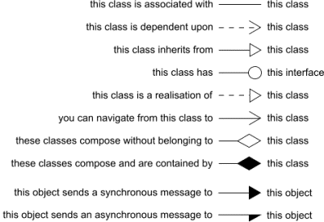

# Notes on UML

## Class 

### Class attributes

[][1]

## Connectors

[][2]

[1]: https://www.dragon1.com/modeling-languages/uml
[2]: http://www.ivencia.com/index.html?/softwarearchitect/chapter1/chapter1.htm